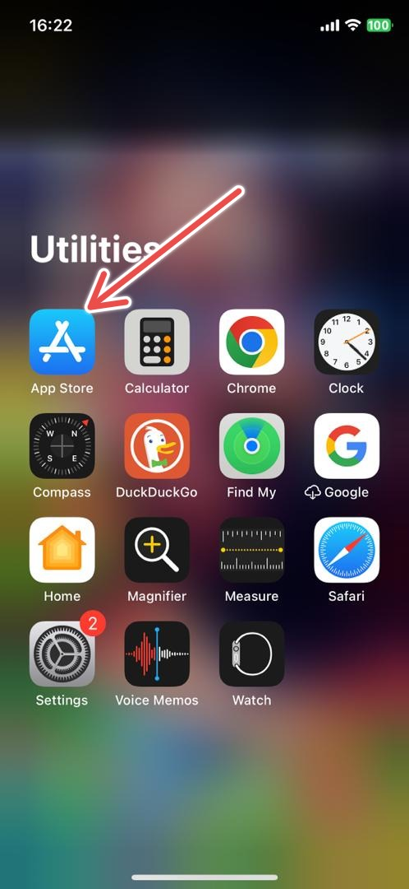

# **Google Chrome for mobile devices: user guide**

## **Outline**

1\.	**Introduction**

1\.1 Why Google Chrome?

2\.	**How to use Google Chrome**

2\.1 Installation

2\.2 Getting started

2\.2.1 Navigation

2\.2.2 Functions

2\.2.3 Troubleshooting

2\.3 Testing Google Chrome for mobile devices	

3\. **Google Chrome Alternatives**	

4\. **Conclusion**

4\.1 More resources

## **1. Introduction**
Google Chrome is a free web browser developed by Google, designed to provide users with a secure browsing experience. It is available for various desktop and mobile devices. This user guide focuses on the mobile version of Google Chrome and how to use it effectively. 
### **1.1 Why Google Chrome?**
Google Chrome is a popular web browser worldwide because it is fast, reliable, and easy to use. Google Chrome also has advanced features unlike other browsers, including automatic translation and an option for synchronization across devices.

Some advantages of Google Chrome are

- **Speed:** Google Chrome is designed to be fast, with a minimalist design that prioritizes speed and efficiency. 
- **Security:** Google Chrome is designed to be secure, with features such as built-in phishing and malware protection, and it receives regular security updates.
- **Ease of Use:** Google Chrome is easy to use, with a simple interface, and it has a range of features, like tabbed browsing, bookmarks, and incognito mode, that make browsing the web more convenient.
- **Customization:** Google Chrome has various extensions and themes to customize your browsing experience. It also has options to block ads or change your browser's appearance. 

## **2. How to use Google Chrome**
### **2.1 Installation**
Install Google Chrome on your mobile device using these steps

1) Open the app store on your device (Google Play Store for Android or App Store for iOS).
1) Search for "Google Chrome"
1) Tap "Install" and follow the download and installation instructions

### **2.2 Getting started** 
#### **2.2.1 Navigation** 
The home page on Google Chrome for mobile devices has the following interface features 

- An **address bar** where you can enter the URL of websites you want to visit and items can be typed here to search for them on Google.
- A **tabs button** that displays open tabs in Google Chrome for mobile devices. **To open a new tab**, tap the plus icon in the top right corner, or tap on the tab button if multiple tabs are open. **To switch between tabs**, tap on the tabs button and any tabs displayed afterwards, or swipe left or right on the address bar.
- A **browser** **menu button**–a three-dot icon in the top right corner–grants access to additional features such as bookmarks, settings, and history.
- **Language options** beneath the search bar to change the browser's language.
- A **sign-in button** to sign into your Google account
- A **Google menu button** which can be used to access your Google applications if you are signed in to your Google account.
- A **home icon** which can take you back to the browser's home page
#### **2.2.2 Functions**

- **Browsing the web:** To browse the web, enter a URL or search term in the address bar and tap "Go" on your keyboard. You can also navigate to a website by tapping on a link from another app or search engine. 
- **Tabs:** To open multiple tabs, click on the tabs button. To open a new tab, tap on the "+" icon. To close a tab, swipe it off to the side. You can also switch between tabs by swiping left or right.
- **Incognito Mode:** To activate the incognito mode, tap the three dots in the top right corner and select "New Incognito Tab." You can browse the internet without saving your browsing history or cookies in incognito mode. 
- **Bookmarks:** To access your bookmarks, tap on the menu button and select "Bookmarks." 

  **To bookmark a website**, tap the star icon on the address bar or tap on the menu button, select "Bookmarks," then tap on the "+" icon. 

  **To edit an existing bookmark**, tap on the menu button, select "Bookmarks," then tap on the bookmarked website you want to edit and make your changes. 

- **History:** To view your browsing history, tap the menu button and select "History." This will show a list of the websites you've visited recently.
- **Downloads:** To view your downloads, tap the menu button and select "Downloads." This will show a list of the files you've downloaded.
- **Settings:** To access the settings, tap on the menu button and select "Settings." This function allows you to customize various features, including your homepage, privacy, and security settings.
- **Syncing with other devices:** You can sync your browsing history, bookmarks, and settings across all your devices with Google Chrome if you have a Google account. To enable syncing, tap on the menu button, select "Settings," tap on your Google account name, and select the items to sync.
- **Voice search:** To use the voice search feature, tap the microphone icon in the address bar and speak your search term.
- **Image search:** To use the image search function, tap the image icon in the address bar, upload the image from your gallery, or take a picture with your camera.
#### **2.2.3 Troubleshooting**
If you experience any issues with the Google Chrome browser for mobile devices, follow these troubleshooting suggestions 

- **Restart the browser** by closing and reopening it
- If restarting the browser doesn't work, **force close and relaunch the browser** as follows
1. For Android users
   1) Go to **Settings** on your device
   1) Search for **Chrome** under **Apps & notifications** and select it
   1) Tap **Force stop** to force close and relaunch the browser 
1. For iOS users
   1) Go to **Settings** on your device
   1) Search for **Chrome** and select it
   1) Click the Background App Refresh button 
- **Clear your cache files** as follows
1. For Android users
   1) Go to **Settings** on your device
   1) Search for **Chrome** under **Apps & notifications** and select it
   1) Tap Storage & cache and select Clear Cache 
1. For iOS users
   1) Go to **Settings** on your device
   1) Search for **iPhone storage** and select it
   1) Search for Chrome and select **Offload App**
- If the steps above are ineffective, **reboot your device** by pressing and holding down the power button and choosing restart from the menu.
### **2.3 Testing Google Chrome for mobile devices**
To test your browser, you can use the **Appwrite website** as follows 
1. Type the **Appwrite web address** (https://appwrite.io) in the address bar

   **OR**

2. Type "**Appwrite**" in the address bar and click on the result with the **Appwrite web address** 

# **3. Google Chrome Alternatives**
Alternative web browsers available for mobile devices include 
- Firefox 
- Opera 
- Safari
# **4. Conclusion**
The Google Chrome browser for mobile devices is a useful tool for browsing the internet on your mobile device. This user guide helps you utilize its features and capabilities. Google Chrome remains one of the most popular browsers, with versions available for Android and iOS devices.
### **4.1 More resources**
More detailed information about Google Chrome can be accessed at

- Google Chrome Help:[ https://support.google.com/chrome/?hl=en](https://support.google.com/chrome/?hl=en)
- Google Chrome Privacy Policy:[ https://www.google.com/chrome/privacy/privacy-policy/](https://www.google.com/chrome/privacy/privacy-policy/)
- Google Chrome Terms of Service:[ https://www.google.com/chrome/terms/](https://www.google.com/chrome/terms/)
